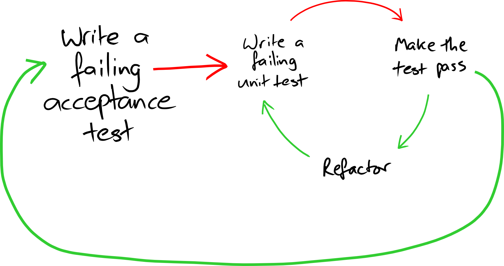

# The Android Development Process

Here we describe in general terms the development process that we propose.  We start with a high-level description, then we follow with a more detailed description of the various parts of the process.  Many of the things that we talk about have been described at length in other books; for instance, TDD or User Stories.  Yet there are many different ways to see these subjects.  In our work experience, it always pays to recap the fundamentals.  For it usually happens that the people in the room have different ideas of what TDD or User Stories are.  So bear with us, so that when we talk of TDD, or other fundamental parts of the process, we are all on the same page.

## At a glance

You have an idea for a great app.  What steps do you take to make it real?  The framework that we describe will orient your actions.

###  Planning

   1. Break the project in user stories
   2. Select the first user story you want to deliver
   3. Write concrete *examples* of how the user story will work.

### Execution

   1. [Optional] Start with a Spike
   2. Create the project
   3. [Optional] Automate an example with an End-to-end Acceptance Test
   4. Implement the example, in TDD, usually using the *presenter-first* technique
   5. Connect the presenter with the view
   6. Test the example manually on the device
   7. If you have an end-to-end test, check that it works.
   8. Choose the next example and go to 4.

This is a rough outline.  It will rarely be this linear in practice; for instance it will happen that when you test the application manually, you will notice things that you want to change.  You will add them to your todo-list.

The loop between steps 4 and 8 should be executed in minutes, not hours... don't spend too much time without checking that your code works on the device.  Conversely, don't rely only on the device for getting feedback on your code.

## Break down a project in User Stories

Do we need a plan?  Yes we do.  Without a plan, we risk to lose *focus*.  The app we have in mind will need many features and details.  If we work on more than one thing at once, we disperse our time and energy.  So the main reason for planning is that we want to focus on a single thing at a time.  Focus and prioritize:

 1. Make a list of the things you want to do
 2. Choose the first thing you want to do
 3. Do that thing and nothing else until it's done.

This is the Agile way to work.  And one more thing: make it so that the things you work on are so *small* that you can build them in hours.  This way you will produce a steady stream of small successes.

So, how do we produce a list of things to do?  We write user stories.

A user story is simply a brief description of something that a user can do with the application.  A user story has:

 1. A Title
 2. [Optional] a Description
 3. [Eventually] an Acceptance Criterion

When you start thinking about the user stories for a project, you will probably start with just a bunch of titles.  Some stories can be further clarified with a brief description.  Before you implement them, you will need to clarify the Acceptance Criterion.  An Acceptance Criterion can be further clarified with Examples.

### Example: a Todo-List application

If I wanted to implement a Todo-List app, I would probably want the following user stories:

 * Create new lists
 * Show the items of a list
 * Add an item to a list
 * Mark an item as done

This is a good set of stories to start.  As we keep thinking, many more stories will come up, related to renaming lists and items, deleting, sharing, notification, etc.

X> Exercise: write the list of user stories for an app that reads blog feeds.

### Rules for user stories

 * Demoable: when the story is done, there should be something *visible* to prove that it's done.
 * Small: it should be possible to implement a story in hours, or at most in a day or two.  Break down big stories in small ones.
 * Independent: it's usually possible to build user stories in any order.  For instance: you can demo the "Show the items of a list" user story before the "Add an item to a list" story: just show a few canned items that you instantiate inside the application code.

## Concrete examples

An Acceptance Criterion can be a general statement of what the application should do.  For instance, the AC for the user story "Hide items when done" could read like

    When an item is marked as 'done' it will be hidden after one week.

To make sure that we understand correctly what this means, we translate it to concrete Examples.  Usually we do this through a conversation with our customer.

> Given Item "Buy milk" that was marked "done" on 1st March 2015 at 14:00:00 \\

> **Example: item not yet hidden** \\
>    When the current date and time is 8th March 2015 at 13:59:59 \\
>    Then the item is shown \\

> **Example: item hidden**
>    When the current date and time is 8th March 2015 at 14:00:00
>    Then the item is NOT shown

As you can see, where the AC talks in general terms "An item marked as *done*", the examples are about concrete things: a specific item "Buy Milk" that was marked done in some specific instant in time.

Writing the examples is an useful thing, because

 1. They remove ambiguity: what does "after one week" means exactly?  Now we know: it's not just the calendar day, it's also the time of day that matters.
 2. The examples become tests: we can execute them both manually (for instance, by artificially changing the clock of the device) or automatically.

Another name for Examples is Scenarios.

The concept of Example/Scenario is crucial, because it drives development.  A scenario is the smallest unit of functionality that can be delivered.

## Start with a Spike

What is a spike? A *spike* is an experiment that you do in order to explore how to do a feature.  A spike will usually not have tests, will be quick and dirty, will not be complete, will not follow our usual rules for good quality.  It's just an exploration.

Spikes are important because we do often have to work with APIs that we don't know well.  This is particularly true in the Android environment, where we have to deal with complex, rich components whose behaviour is not clear until we start playing with them.

Important point: don't try to write TDD with APIs that you don't know well.  There is the risk of wasting a lot of time writing ineffective tests.

So, whenever we start working with a bit of Android APIs that we don't know well, it pays to start with a little experiment.

The rules for spikes are:

  2. Goal: you have a learning goal for the spike
  2. Timebox: you set yourself a time limit; for instance, two hours.
  1. New project: start the spike in a new project (not by hacking into your production code)
  3. Throw away: after you're done, you *throw away* the spike code.  You may keep the spike around as a *junkyard* of bits to copy from; but you never turn the spike into your production project.  Start production code with a fresh project.

## Test-Driven Development

TDD is about writing code in *small increments*, driven by an *automated test*, keeping the code *as simple as possible* at all times.  This process has a dual nature: it is a way to *design* programs, and also is a way to build a good *suite of tests*.

The process was described first by Kent Beck in [Test-Driven Development: By Example](#tdd).  It's probably still the best book on the subject.  It's a subtle book: it seems like it's glossing over many things, but when you go back to it and read it again, you find it has new answers to your questions.

### The micro-cycle

The process is easy to describe.  Kent Beck in [Test-Driven Development: By Example](#tdd) writes the following sequence:

  1. Quickly write a test
  2. Run all the tests, see the new one fail
  3. Make a small change
  4. Run all the tests, see them all succeed
  5. Refactor to remove duplication

Note the emphasis on "small": the cycle is meant to be repeated every few minutes, not hours.  The point of TDD is to provide quick feedback on the quality of your code.

If you've never seen an accomplished TDD practitioner at work, it's difficult to grasp how the TDD cycle should be done.  We suggest you to watch good TDD videos, like the [TDD Videos by Kent Beck](#beck-video)

## Presenter First

How do you TDD a GUI application?

The Presenter First style of TDD is usually appropriate when we write GUI applications.  The idea is that you start by postulating that you will have at least two objects: a *Presenter* and a *View*.  The *Presenter* is an object that represents your whole application, or a significant subset of your application.  The *View* represent the GUI screen that your application will use.

One key idea is that all application logic goes in the Presenter, while all technical details of how to show windows etc to the user go in the view.

Another key idea is that you start TDD with the presenter.

J.B. Rainsberger popularized the concept in his video [The World's Best Intro To TDD](#jbrains-tdd-video) and in his book [Responsible Design For Android](#jbrains-android)

When we describe what a GUI application does, we usually reason in terms of "when the user does THIS, then the application shows THAT".  For instance, consider an application that shows a counter that can be incremented by the user by pressing a button.  Our Example will say:

>    **Example: increment**
>    Given that the current counter value is 0
>    When the user presses the "INC" button
>    Then the view will show 1

### First version: not yet quite presenter-first

A simple test for this example could be

    CounterApp app = new CounterApp(0);
    app.increment();
    assertEquals(1, app.valueToDisplay());

This test is adequate.  You can use it to develop your application.  It's easy to connect this `CounterApplication` logic to a GUI written in Android.  In the following code, we show how to use the `CounterApp` in an activity:

{line-numbers=on}
~~~~~
public class CounterActivity extends Activity {
  private CounterApp app = new CounterApp();

  @Override
  protected void onCreate(Bundle savedInstanceState) {
    super.onCreate(savedInstanceState);
    setContentView(R.layout.activity_counter);

    Button incrementButton = (Button) findViewById(R.id.increment);
    incrementButton.setOnClickListener(new View.OnClickListener() {
      @Override
      public void onClick(View v) {
        app.increment();
        TextView textView = (TextView) findViewById(R.id.counter);
        textView.setText(String.valueOf(app.valueToDisplay()));
      }
    });
  }
}
~~~~~

In lines 9-10 we make sure that when the user clicks the "increment" button, Android will call us back.   In line 13 we increment the counter, and in lines 14-15 we update the text label.

### Really presenter-first

The previous example works and is adequate for most purposes; yet it's not completely satisfactory.  We need to write many lines of "glue" to make sure that we are really getting the right data from the CounterApp and using correctly in the activity.  We are calling the CounterApp twice, one for communicating the fact that the user has pressed the button, and another time for asking back the CounterApp for the value to display.

This is adequate for such a small application, but becomes boring when the number of bits of user interface that *could* change increases.  If we had 100 text fields on the GUI, we wouldn't like to ask 100 questions to the app so that we can update them all.

    // Something we would definitely NOT want to do
    public void onClick(View v) {
      app.doSomething();
      // ask the app the value of ALL fields in case one of them
      // is changed...
      findViewById(R.id.display0).setText(app.valueToDisplay0()));
      findViewById(R.id.display1).setText(app.valueToDisplay1()));
      findViewById(R.id.display2).setText(app.valueToDisplay2()));
      findViewById(R.id.display3).setText(app.valueToDisplay3()));
      findViewById(R.id.display4).setText(app.valueToDisplay4()));
      findViewById(R.id.display5).setText(app.valueToDisplay5()));
      // etc etc ...
    }

It would be much better if the app could update directly the fields it wishes to change.  What if it was simply like this:

~~~~~
public class CounterActivity extends Activity {
  private CounterApp app = new CounterApp(this);

  @Override
  protected void onCreate(Bundle savedInstanceState) {
    super.onCreate(savedInstanceState);
    setContentView(R.layout.activity_counter);

    View incrementButton = findViewById(R.id.increment);
    incrementButton.setOnClickListener(new View.OnClickListener() {
      @Override
      public void onClick(View v) {
        // Just notify the app, it will do the rest
        app.increment();
      }
    });
  }
}
~~~~~

The activity is vastly simplified: all we have to do is call `app.increment()` whenever the user clicks the button.

~~~~~
public class CounterApp {
  private int value;
  private CounterActivity counterActivity;

  public CounterApp(CounterActivity counterActivity) {
    this.counterActivity = counterActivity;
  }

  // We're not quite there yet!
  // We shouldn't mess with the internals of the activity!
  public void increment() {
    value++;
    TextView view = (TextView) counterActivity.findViewById(R.id.counter);
    view.setText(String.valueOf(value));
  }
}
~~~~~

The changing of the value displayed on the GUI has become a responsibility of the CounterApp.  We don't really like this; we'd like to be able to tell the activity "show this value!" and let the activity deal with the details of which element of the view to update.

We have created a circular dependency between the activity and the app

    +--------------+               +-------------------+
    |  CounterApp  | <---------->  |  CounterActivity  |
    +--------------+               +-------------------+

And this is bad.  We would much prefer that the CounterApp be independent of the CounterActivity.  Luckily, there is a standard way to break circular dependencies: introduce an interface!

    +--------------+               +----------<I>-+
    |  CounterApp  | ----------->  |  CounterGui  |
    +--------------+               +--------------+
                                          ^
                                          |
                                 +-------------------+
                                 |  CounterActivity  |
                                 +-------------------+

We introduce an interface we call `CounterGui` (We could have chosen the name `CounterView`, but that could create confusion with the way Android uses the word "view")

So let's start again with the presenter.  We write a test of what the CounterApp should do when the increment method is called.  The test should do, in pseudo code:

    Given the CounterApp holds a reference of the CounterGui as a collaborator
    when we call increment on the CounterApp
    then the CounterGui receives a call to display "1"

We want to test CounterApp without ever referring to the CounterActivity, that in our intentions will be the one real implementation of CounterGui.  Therefore, we need a fake implementation of CounterGui.  Our fake implementation will be passed as a collaborator to the CounerApp, and it does not need to implement a real GUI; all we need is that we can check that the proper call(s) to it have been made.  This type of fake implementation of an interface is called a "Mock".

D> Definition: a "mock" is a fake implementation of an interface that can be used to verify that certain calls have been made to it.

There are more than one way to write this mock.  The simplest way needs no particular mocking frameworks.  Just let the test class implement the interface that we want to use.
~~~~~
// Our test class implements CounterGui
public class CounterAppTest implements CounterGui {

  @Test
  public void increment() throws Exception {
    // We create the app, passing the test class itself as a collaborator
    final CounterApp app = new CounterApp(this);

    // Whenever we call
    app.increment();

    // We expect display(1) to have been called
    assertEquals(Integer.valueOf(1), displayedNumber);
  }

  // we use this variable to check that CounterGui#display(1) was called
  Integer displayedNumber = null;

  // and this is our fake implementation of CounterGui#display
  @Override
  public void display(int number) {
    this.displayedNumber = number;
  }
}
~~~~~
Note that writing this test forces us to define the one method that the CounterGui needs to have, namely `display`.  We use a trick to verify that the display method has really been called.  If it is not called, the value of `displayedNumber` remains null.  If it is called, the value of `displayedNumber` is the value of the argument to the call.

This is enough to allow us to see the test fail, and then build the right functionality within CounterApp to make it pass.

Note, however, that if CounterApp made more than one call to CounterGui, we would not be able to detect this.  We only retain the argument of the last call.

Using a mocking framework such as JMock or EasyMock solves this problem.  It also makes it easier to specify precisely what we expect: "just ONE call to CounterGui#display with the argument 1".  The price we pay is that we need to use more sophisticated machinery.

The following is the same test, implemented with JMock.
~~~~~
public class CounterAppTest {

  // This is the JMock machinery that we need
  @Rule public JUnitRuleMockery context = new JUnitRuleMockery();

  public void testIncrement() throws Exception {
    // We ask JMock to make a mock of the CounterGui interface
    final CounterGui gui = context.mock(CounterGui.class);

    // We create the app, passing the gui as a collaborator
    final CounterApp app = new CounterApp(gui);

    // We setup our expectations
    context.checking(new Expectations() {{
      // Exactly one time, gui will be called with display(1)
      oneOf(gui).display(1);
    }});

    // Whenever we call
    app.increment();
  }
}
~~~~~

<!-- To implement this sort of things in presenter-first style, we write a test like

    context.checking(new Expectations() {{
      oneOf(view).showThat();
    }});
    application.doThis();

Here `application` is the Presenter.  The view is a mock of an interface.  The -->

## Acceptance-TDD (ATDD)

One pattern that is mentioned in the original [TDD book by Kent Beck](#tdd) is "Child Test".  It means that when it takes me too long to get a test to pass, it probably means that the test represents too big a step for me.  In that case, Beck suggests that you comment out the problematic test, and start writing a simpler test, a "child test".  The child test lets me take a smaller step in the direction of making the larger test pass.  After a while, and probably after several TDD cycles, we are ready to make the big test pass.

One instance of the Child Test pattern is when we write an end-to-end acceptance test as a first step in getting a new feature to work.  That test is likely to take more than a few minutes to pass.  In Android, an end-to-end test will also take minutes to run.  Yet, the end-to-end test is very useful.

 1. It makes me think hard about *examples* of the desired functionality
 2. It makes sure that the configurations are correct and that all the objects inside the application talk to each other correctly

For this reason, it pays to apply Child Test to end-to-end tests.  We start every feature by writing on paper some examples (scenarios) of how the feature will work.  Then we translate those scenarios into end-to-end acceptance tests.  When we are satisfied that they fail, and that they fail for the correct reason, then we comment them out.

This style of work is sometimes called "Acceptance Test-Driven Development" or ATDD.  It was popularized by Freeman and Pryce in the book [Growing Object-Oriented Software](#goos).  Below you can see the picture from their book:

{width=100%}

When we do TDD we often exercise objects in isolation from each other.  The mocks approach explained in [GOOS](#goos) is particularly good in this respect.  The end-to-end AT helps making sure all the objects that we TDDed in isolation talk to each other correctly. Thus we mitigate the risk of mock-based tests making false assumptions on how the real (non-mocked) collaborators really work.

## Mock objects

Quick, what are mock objects good for?  If you answered "for isolating dependencies" then Bzzzzzzt! You got it wrong!

The real reason why mocks are useful is that they help us developing *protocols*, that is a set of messages that an object must understand in order to fulfill a *role* in an object-oriented system.

<!-- Some objects have responsibilities for *knowing* things.  For instance, a Point object might be responsible for knowing its cartesian coordinates, and it might be a reasonable implementation to give this object "getter" methods so that we can know where in the plane is this Point.

Other objects have responsibilities for *doing* things.  For instance, a Point object could be responsible for knowing how to draw itself on a canvas.

It's easy (if maybe boring) to use TDD to develop the first kind of Point.  But how would you use TDD to define the behaviour of the second kind of test? -->

### Tell, don't ask

An object works by sending and receiving *messages*.  When an object receives a message, it can react by sending messages to other objects.  How do we test an object then?  The simple way is to send a message to an object and then use *getters* to access the object internal state.  One problem with this is that the getters will force us to expose at least part of the object's internal representation.  This will make it harder to change the object.

Not only that.  Using getters will push us to separate data and behaviour.  Consider

    if (point.isPolar()) {
      x = point.getRadius() * Math.cos(point.getAngle());
      y = point.getRadius() * Math.sin(point.getAngle());
    } else {
      x = point.getX();
      y = point.getY();
    }
    canvas.drawPoint(x, y);

We ask the point a question: *are you represented with polar coordinates?* Then depending on the question we do one thing or another.  What we have is that the point is a dumb data structure with no behaviour.  The code that uses the point is doing all the reasoning and has all the behaviour; it converts from polar coordinates to cartesian if necessary, then draws the point on a canvas.

Why do we open up the object and see its internals?  We don't have to!  We could ask the point to give us the cartesian coordinates, doing the conversion internally if necessary.  The above code becomes

    x = point.getX();
    y = point.getY();
    canvas.drawPoint(x, y);

But we can go one step further.  What if the code was

    if (!point.isInvisible()) {
      canvas.drawPoint(point.getX(), point.getY());
    }

Why do we have to ask all this questions to the point object?  Couldn't we just ask it to draw itself unless it's invisible?

    point.drawYourselfUnlessInvisibleOn(canvas);

Now the calling code is much simpler! And it's a lot easier to maintain.  Suppose we add a *color* to the point.  The old calling code would have to change to

    if (!point.isInvisible()) {
      canvas.drawPoint(point.getX(), point.getY(), point.getColor());
    }

but the new calling code does not change much

    point.drawYourselfUnlessInvisibleWithAppropriateColorOn(canvas);

We can increase this isolation by making the name of the message simpler:

    point.drawYourselfOn(canvas)

Here we don't want to know *any* detail: nothing about color, shape, visibility, or anything else.  This isolation makes code **much easier to change**, because changes in the protocol between point and canvas will not impact the callers of either.

This preference for telling objects to do things rather than asking objects to return values was called "Tell, don't ask!" in a famous paper by Andy Hunt and Dave Thomas (TBD - reference).

### Mocks

I hope I've convinced you that *Tell, don't ask* is good.  Now you have a problem: how do you test an object that does not have getters?  Ha!

The only way to do test such an object is to *observe its behaviour*.  That is, we send it a message, and observe what other messages it sends to its neighbours.  I send a `drawYourselfOn(canvas)` message to the point, and I want to test that the canvas was used correctly.  How could I test that?  Should I ask the canvas?  That would require adding *getters* to the canvas.

    // Bleah!  Don't do this!
    for (int x=0; x<=canvas.getMaxX(); x++) {
      for (int y=0; y<=canvas.getMaxY(); y++) {
        if (x == point.getX() && y == point.getY())
          assertEquals(point.getColor(), canvas.getColorAt(x, y));
        else
          assertEquals(WHITE, canvas.getColorAt(x, y));
      }
    }

I'd rather express my test (in pseudocode) this way:

{lang=plain}
    I expect that
      canvas will receive drawPoint(x, y)
    whenever I do
      point.drawYourselfOn(canvas)

So instead of an *assertion* we have an **expectation**.  We expect that the canvas will be called in a certain way, *and nothing else*.  The nice thing in this test is that *we don't care what's the behaviour of the canvas*.  For all we care, we can just assume that `canvas` is just an interface.  This means that we can develop an object with TDD before its collaborators even exist!

The above test, expressed in JMock, would look like the following:

    Point point = new Point(10, 20);
    Canvas canvas = context.mock(Canvas.class);
    context.checking(new Expectations() {{
      oneOf(canvas).drawPoint(10, 20);
    }});
    point.drawYourselfOn(canvas);

The point of this test is that we can use it to define how the point should talk to its collaborator.

The syntax looks a bit esoteric at first, but it will all make sense.  The details on how JMock works are [in the appendix](#appendix-jmock).  More about mocks in [GOOS].

## Skin & Wrap the API

TBD Reference Working Effectively With Legacy Code

