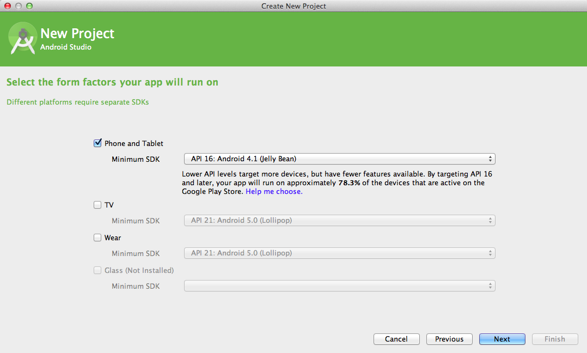

# Hello, World!

In this chapter we see how to set up a project properly for our purposes.  We will execute a small "hello, world" kata. All the other projects in this book start the same way, except that the name of the project will be different each time. You should be able to execute this kata easily in 25 minutes, or one "pomodoro".

## First step: new project!

Start Android Studio and generate a new project with default options.  Change only the names of the project, the package and the main activity.

{width=60%}

{width=60%}

{width=60%}

{width=60%}

Run the project and observe the "hello, world" message on the screen of your device.

{width=50%}

## Change the text

Now we alter the view.  We want to be able to change the "Hello, world!" message programmatically.  We change the `app/res/layout/activity_hello_world.xml` this way:

{lang=xml, line-numbers=on}
~~~~~
<RelativeLayout xmlns:android="http://schemas.android.com/apk/res/android"
                xmlns:tools="http://schemas.android.com/tools"
                android:layout_width="match_parent"
                android:layout_height="match_parent"
                android:paddingLeft="@dimen/activity_horizontal_margin"
                android:paddingRight="@dimen/activity_horizontal_margin"
                android:paddingTop="@dimen/activity_vertical_margin"
                android:paddingBottom="@dimen/activity_vertical_margin"
                tools:context=".HelloWorldActivity">

    <TextView
        android:id="@+id/message"
        android:textSize="48sp"
        android:layout_width="wrap_content"
        android:layout_height="wrap_content"/>
</RelativeLayout>
~~~~~

We removed the canned message string, and we added an id to the TextView, on line 12.  We also added a textSize attribute so that the message is shown much bigger, on line 13. Now we can change the message in the `HelloWorldActivity`:

~~~~~
public class HelloWorldActivity extends ActionBarActivity {
  @Override
  protected void onCreate(Bundle savedInstanceState) {
    super.onCreate(savedInstanceState);
    setContentView(R.layout.activity_hello_world);
    TextView view = (TextView) findViewById(R.id.message);
    view.setText("Ciao!");
  }
}
~~~~~

We run the application again, and we see that the message has changed.

{width=50%}

## Introduce a new module

We now want to move the logic that produces the error message away from the `app` module, into a new module that will contain pure Java logic, free from any dependency on the Android APIs.  By convention, we always call this module `core`.

Create a new module with Android Studio.  Remember to change the package name.  Android Studio requires us to name the first class in this module, so we call it `HelloWorld`.

{width=60%}

{width=60%}

{width=60%}

## First unit test

We now introduce a first unit test.  Create directory `core/src/test/java`; you can do this with either the command line or within Android Studio.  If you choose the latter, remember to switch to the Project view first.

{width=60%}

Then you right-click your way through the project and create directory `test` under directory `src`, and then you create directory `java` under directory `test`.  The end result should be as in the following screenshot.

{width=50%}

Now you create a new class called `HelloWorldTest` in directory `core/src/test/java` with the following content:

~~~~~
package com.tdd4android.helloworld.core;

import org.junit.Test;
import static org.junit.Assert.assertEquals;

public class HelloWorldTest {
  @Test
  public void testHelloWorld() throws Exception {
    assertEquals("42", new HelloWorld().message());
  }
}
~~~~~

The `message` method does not compile, because we didn't create any method in class `HelloWorld`.  We fix quickly like this:

~~~~~
package com.tdd4android.helloworld.core;

public class HelloWorld {
  public String message() {
    return null;
  }
}
~~~~~

We run all the tests in module `core`, and we see a failure: it seems that JUnit is not in the project classpath.

{width=100%}

We fix it by changing `core/build.gradle`

{lang=groovy}
~~~~~
apply plugin: 'java'

// Fix the version of Java; 1.7 is the highest version supported by Android
sourceCompatibility = 1.7

dependencies {
    compile fileTree(dir: 'libs', include: ['*.jar'])

    // Add dependency on JUnit
    testCompile 'junit:junit-dep:4.11'
}

// Improve test logging
test {
    testLogging {
        events "passed", "skipped", "failed", "standardOut", "standardError"
    }
}
~~~~~

We run the tests again, and look!  We now fail for the right reason!

{width=100%}

We fix the `HelloWorld` class and we get a green bar.

{width=100%}

## Using the core logic in the app

Now we want to use our new nifty HelloWorld class to produce the message on the Android device's screen.  We change `HelloWorldActivity` as follows:

~~~~~
package com.tdd4android.helloworld;

import android.app.Activity;
import android.os.Bundle;
import android.widget.TextView;
import com.tdd4android.helloworld.core.HelloWorld;

public class HelloWorldActivity extends Activity {
  @Override
  protected void onCreate(Bundle savedInstanceState) {
    super.onCreate(savedInstanceState);
    setContentView(R.layout.activity_hello_world);
    TextView view = (TextView) findViewById(R.id.message);
    view.setText(new HelloWorld().message());
  }
}
~~~~~

We try to run the application, and it does not compile.

{width=60%}

 We need to change `app/build.gradle` to let module `app` depend on module `core`.

{lang=groovy}
~~~~~
apply plugin: 'com.android.application'

android {
    compileSdkVersion 21
    buildToolsVersion "21.1.2"

    defaultConfig {
        applicationId "com.tdd4android.helloworld"
        minSdkVersion 16
        targetSdkVersion 21
        versionCode 1
        versionName "1.0"
    }
    buildTypes {
        release {
            minifyEnabled false
            proguardFiles getDefaultProguardFile('proguard-android.txt'), 'proguard-rules.pro'
        }
    }
}

dependencies {
    compile fileTree(dir: 'libs', include: ['*.jar'])
    compile 'com.android.support:appcompat-v7:21.0.3'

    // We need classes from module "core"
    compile project(':core')
}
~~~~~

We run the application again and it works!

{width=50%}

