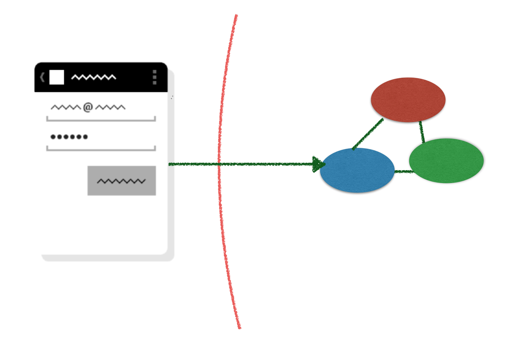
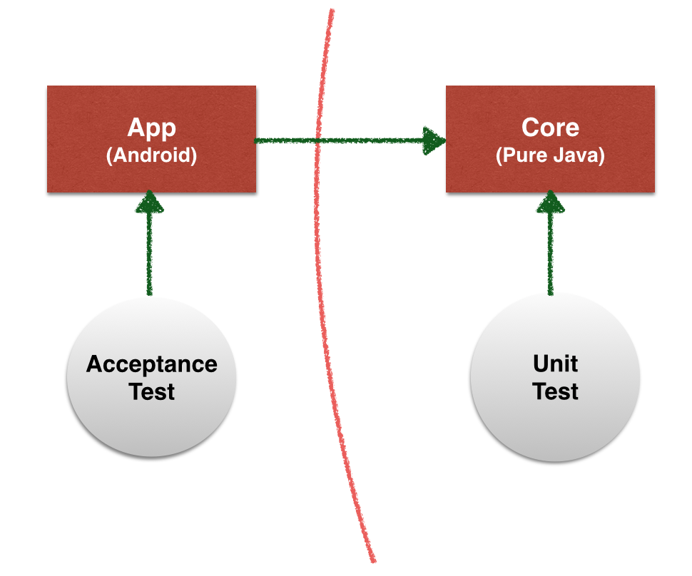

# Some tests are more useful, some tests are less

Why do we write tests?  To me, the value I get from tests is mainly two things:

  * To make sure that the software works as I expect
  * To get help design the software

(both being equally important to me.)  The overall goal behind all of this is to be able to deliver software faster (as Dan North says in his book [https://leanpub.com/software-faster](https://leanpub.com/software-faster)).

Now, if you read some Android testing literature, you are being encouraged to write tests like this one:

~~~~~~~~
public class GuiTest extends ActivityInstrumentationTestCase2<MainActivity> {
    public GuiTest() {
        super(MainActivity.class);
    }

    public void testMessageGravity() throws Exception {
        TextView myMessage = (TextView) getActivity().findViewById(R.id.myMessage);
        assertEquals(Gravity.CENTER, myMessage.getGravity());
    }
}
~~~~~~~~

This is test of the GUI layout.  We write it, we run it (which requires launching an Android emulator, or downloading the code to a real device), and we get a red bar:

~~~~~~~~
junit.framework.AssertionFailedError: expected:<17> but was:<8388659>
~~~~~~~~

Now we go to the `content_main.xml` file and set the proper gravity:

{lang=xml}
~~~~~~~~
<TextView
    android:text="Hello World!"
    android:id="@+id/myMessage"
    leanpub-start-insert
    android:gravity="center"
    leanpub-end-insert
    android:layout_width="wrap_content"
    android:layout_height="wrap_content" />
~~~~~~~~

We run the code again, and look! It passes!

What have we accomplished here? Did we get value out of this testing?  Let's see:

 * Maing sure that the software works as I expect: do we get any extra assurance now?  Not really.  We just added a declaration in the XML file.  What we really care about is that the message *looks right*.  All we know is that it has a certain property.
 * Getting help in designing the software: not at all.  It's not like we're using the test to understand what line of code we should write. We knew perfectly well that we wanted to write that `android:gravity="center"` line of code, before writing the test. Writing the test was done just to grant ourselves *permission* to write the line of code we already knew we wanted.

I call tests like this one "bureaucratic tests", because they look like I have to sign a request form (the test) just to get permission to write a line of code I already think I need.

* * *

What kinds of tests are valuable, then?

In TDD, like in XP, it all starts from what is valuable *for the customer* of the software.  So we start from the requirements, and work backwards to understand what we need to write.  A user story is made up of a number of *scenarios*, or *concrete examples*, of what the software should do.  So we write one test for each of these scenarios.  This is well explained in the many resources on BDD, ATDD and Cucumber; however, I don't recommend that you write your tests with Cucumber, necessarily.  You can write these test with JUnit just as well.

When a scenario-level test is too big to pass quickly, then you may ignore it temporarily, and write smaller tests that take you one step closer to getting the original test to pass.  This is a pattern that Kent Beck calls "Child test" and is well explained in his [Test-Driven Development: By Example](#tdd) book.

## Model-view separation

This explanation leaves one question unanswered.  How do we test the GUI then?

We apply one principle: **model-view separation**.

The GUI does not contain any logic.  All the logic is extracted to plain-Java objects that can be developed and tested with no reference to the Android framework.  This principle is a cornerstone of Object-Oriented Design, and is well explained in Craig Larman's book [Applying UML and Patterns](http://www.craiglarman.com/wiki/index.php?title=Books_by_Craig_Larman#Applying_UML_and_Patterns).

When you are developing a new piece of GUI,  you probably want to loop quickly between changing something in the GUI code, and seeing how it looks.  Automated tests are not very useful here: what you care about is how it looks to your eyes.

When you are releasing the app and want to make sure that no screen of your application is broken, you probably want to check every screen by hand.  This is less burdensome that it looks.  If the GUI does not contain any IF, then it's easy to check that it works: you just have to look at every screen *once*.  You can write a **release checklist** that lists all the things you want to look at before releasing the app; it should be possible to perform the tour of the app in minutes.

When you are doing your everyday coding and refactoring, you certainly don't want to check manually that you haven't broken any view at every commit.  For this, you should have **one** end-to-end test for every screen, that tries to perform a basic test of the basic functionality offered by the screen.  These test do not guarantee that the screen looks right, but at least they guarantee that the basic functionality works.

