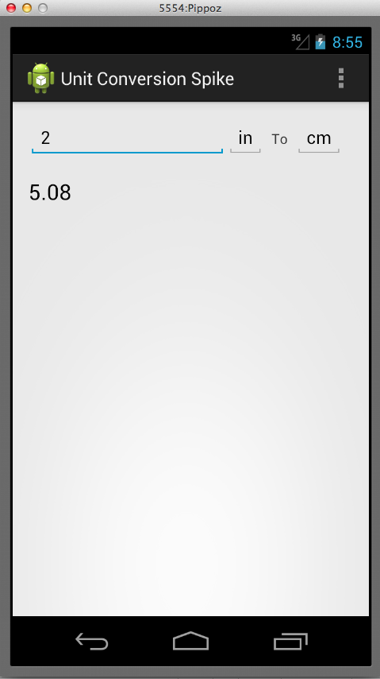

# Example: Unit Converter

## Problem description

We want to write an app that converts from various units to other units.  We imagine that it will support an extensive collection of conversions, from cm to yards, from Fahrenheit to Celsius, from HP to KW.

Yes, I know this feature is already implemented by Google on all phones. I use this example because it will allow me to illustrate some important techniques.  It's not too complicated and not too trivial.

## Examples

The feature we want to implement is "convert a number from one unit to another".  To clarify what we want to do to ourselves and our customer, it's a good idea to write down a few examples (a.k.a. scenarios) of how the feature will work.

Example: inches to cm
Given the user selected "in" to "cm"
When the user types 2
Then the result is "5.08"

Example: Fahrenheit to Celsius
Given the user selected "F" to "C"
When the user types 32
Then the result is "0.00"

Example: unsupported units
Given the user selected "ABC" to "XYZ"
Then the result is "I don't know how to convert this"

See further: BDD

## Start with a spike

When you are using APIs you're not familiar with, it's better to do a *spike* before you start doing real TDD.   A *spike* is an experiment that you do in order to explore how to do a feature.  A spike will usually not have tests, will be quick and dirty, will not be complete, will not follow our usual rules for good quality.  It's just an exploration.  The rules for spikes are

 1. New project: start the spike in a new project (not by hacking into your production code)
 2. Timebox: set yourself a time limit, for instance two hours.
 3. Throw away: after you're done, you *throw away* the spike code.  You may keep the spike around as a *junkyard* of bits to copy from; but you never turn the spike into your production project.  Start production code with a fresh project.

Our spike implements the "inches to cm" and the "unsupported units" scenario.  It took me 3 pomodori to build.

{width=60%}

<<[The activity for the unit conversion spike](../UnitConversionSpike/app/src/main/java/name/vaccari/matteo/unitconversionspike/MyActivity.java)

<<[The layout for the unit conversion spike](../UnitConversionSpike/app/src/main/res/layout/activity_my.xml)

What I learned:

 * How to change the result at every keypress
 * How to use a `RelativeLayout`

## Continue with an end-to-end acceptance test

The first step after the optional spike is to write an end-to-end acceptance test