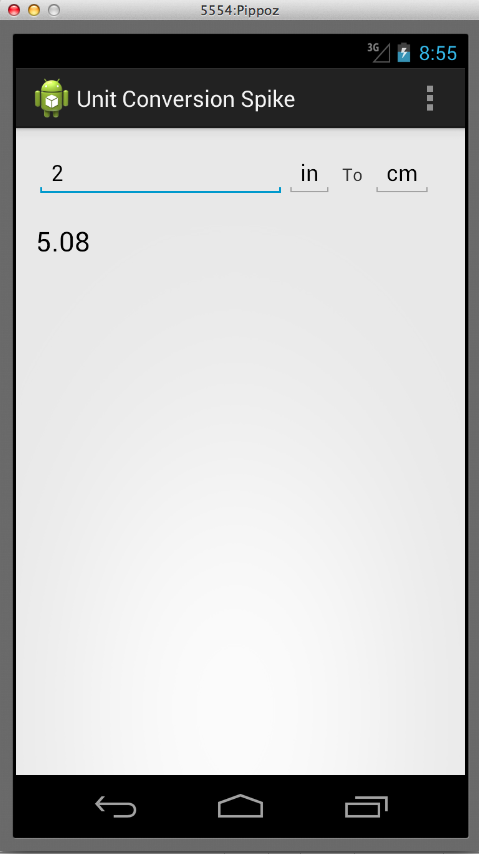
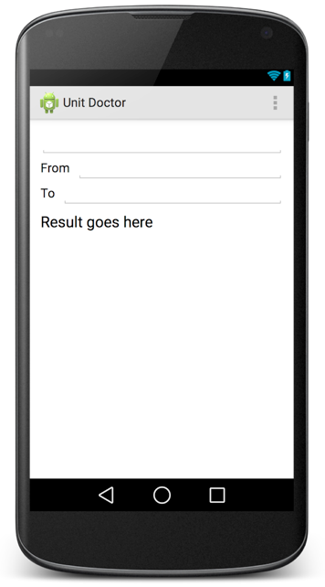
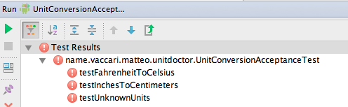
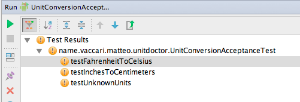
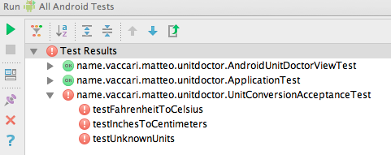
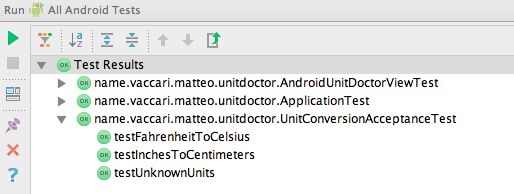
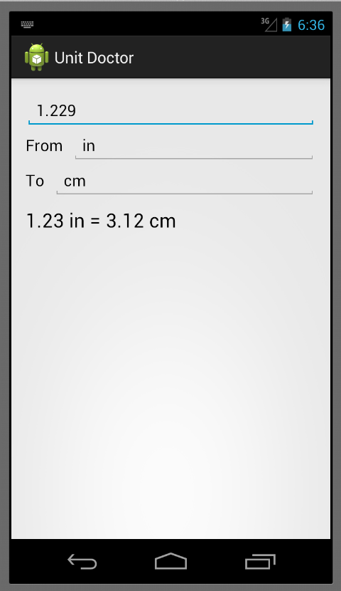

# Exercise: Unit Doctor

## Problem description

We want to write an app that converts from various units to other units.  We imagine that it will support an extensive collection of conversions, from cm to yards, from Fahrenheit to Celsius, from HP to KW.

Yes, I know this feature is already implemented by Google on all phones. I use this example because it will allow me to illustrate some important techniques.  It's not too complicated and not too trivial.

## Examples {#unit-doctor-examples}

The feature we want to implement is "convert a number from one unit to another".  To clarify what we want to do to ourselves and our customer, it's a good idea to write down a few examples (a.k.a. scenarios) of how the feature will work.

> **Example: inches to cm** \\
> Given the user selected "in" to "cm" \\
> When the user types 2 \\
> Then the result is "2.00 in = 5.08 cm"

> **Example: Fahrenheit to Celsius** \\
> Given the user selected "F" to "C" \\
> When the user types 50 \\
> Then the result is "50.00 F = 10.00 C"

> **Example: unsupported units** \\
> Given the user selected "ABC" to "XYZ" \\
> Then the result is "I don't know how to convert this"

Note that by writing down the examples we clarified what exactly the customer expects to see: how numbers are formatted, what the result message should look like.

## Start with a spike

When you are using APIs you're not familiar with, it's better to do a *spike* before you start doing real TDD.

I> ## What is a spike?
I>
I> A *spike* is an experiment that you do in order to explore how to do a feature.  A spike will usually not have tests, will be quick and dirty, will not be complete, will not follow our usual rules for good quality.  It's just an exploration.  The rules for spikes are
I>
I>  1. New project: start the spike in a new project (not by hacking into your production code)
I>  2. Timebox: set yourself a time limit, for instance two hours.
I>  3. Throw away: after you're done, you *throw away* the spike code.  You may keep the spike around as a *junkyard* of bits to copy from; but you never turn the spike into your production project.  Start production code with a fresh project.

The goal of our spike is to understand how the Android API permit catching keypress events and how to position elements in a layout.

We estimate that this can be accomplished by implementing just the "inches to cm" and the "unsupported units" scenarios,

{width=60%}

<<[The activity for the unit conversion spike](../our-android-examples/UnitConversionSpike/app/src/main/java/name/vaccari/matteo/unitconversionspike/MyActivity.java)

{lang="xml"}
<<[The layout for the unit conversion spike](../our-android-examples/UnitConversionSpike/app/src/main/res/layout/activity_my.xml)

As expected, the spike exercise permit us to learn (among other things):

 * How to change the result at every keypress
 * How to use a `RelativeLayout`

In general, we'll use in this book the spike technique as an help to discover the correct point where to place the boundary bewteen android dependent and android independent code.

## Continue with an end-to-end acceptance test

The first step after the optional spike is to write an end-to-end acceptance test.  The rules for an acceptance tests are

 1. Business talk: write at the same level of abstraction as the examples that were discussed with the customer.
 2. Ignore them: when the ATs pass, then the feature is complete.  Therefore it will take some time before all the ATs pass.  We will ignore all the non-passing ATs until they pass.  (Ignore means that we comment them out, or we use some other trick to temporarily remove them from the build.)
 3. Pass once, pass forever.  When an AT passes, it means that some bit of functionality is present in the system.  From this moment onward, the AT must stay green forever.  The AT now works as a non-regression test.

### Workflow

#### Step 0: new project

We create a new project (remember, we don't want to "evolve" the spike!).  I use Android Studio and I let it set up the new project with its wizard.  I invent a fancy name and I call it "Unit Doctor".

{width=60%}

#### Step 1: write the test *as it should read*

Android Studio set up a source folder named `src/androidTest`.  I create a new Java class there.

{line-numbers=on}
~~~~~~~~~~~~~~~~~~~~~~~~~
package name.vaccari.matteo.unitdoctor;

import android.test.ActivityInstrumentationTestCase2;

public class UnitConversionAcceptanceTest
    extends ActivityInstrumentationTestCase2<MainActivity> {

  public UnitConversionAcceptanceTest() {
    super(MainActivity.class);
  }

  public void testInchesToCentimeters() throws Exception {
    givenTheUserSelectedConversion("in", "cm");
    whenTheUserEnters("2");
    thenTheResultIs("2.00 in = 5.08 cm");
  }
}
~~~~~~~~~~~~~~~~~~~~~~~~~

The test is written in the same language as the original example, by imagining that we have implemented the three methods at lines 13-15.

#### Step 2: implement the helper methods

We assume at first that the UI is similar to what we developed in the spike.  So our first implementation of the testing language is quite simple.

~~~~~~~~~~~~~~~
public void testInchesToCentimeters() throws Exception {
  givenTheUserSelectedConversion("in", "cm");
  whenTheUserEnters("2");
  thenTheResultIs("2.00 in = 5.08 cm");
}

private void givenTheUserSelectedConversion(String fromUnit, String toUnit) {
  getField(R.id.fromUnit).setText(fromUnit);
  getField(R.id.toUnit).setText(toUnit);
}

private void whenTheUserEnters(String inputNumber) {
  getField(R.id.inputNumber).setText(inputNumber);
}

private void thenTheResultIs(String expectedResult) {
  assertEquals(expectedResult, getField(R.id.result).getText());
}

private TextView getField(int id) {
  return (TextView) getActivity().findViewById(id);
}
~~~~~~~~~~~~~~~

The test does not compile yet, because the identifiers like `R.id.fromUnit` etc. are not yet defined.

#### Step 3: implement other scenarios

We implement a few other significant scenarios.  This way we check that the testing language that we are developing is expressive enough.

~~~~~~~~~~~~~~~~
public void testFahrenheitToCelsius() throws Exception {
    givenTheUserSelectedConversion("F", "C");
    whenTheUserEnters("50");
    thenTheResultIs("50.00 F = 10.00 C");
}

public void testUnknownUnits() throws Exception {
    givenTheUserSelectedConversion("ABC", "XYZ");
    thenTheResultIs("I don't know how to convert this");
}
~~~~~~~~~~~~~~~~

#### Step 4: implement just enough layout so that we can see the test fail

We turn to editing the layout file so that we can fix all the IDs.  This is the time in which the layout designer specialist (but not us) can express himself.

Now we can run the tests and see them all fail

But are they failing for the expected reason?

{lang="text"}
    android.view.ViewRootImpl$CalledFromWrongThreadException:
    Only the original thread that created a view hierarchy can touch its views.
    at android.view.ViewRootImpl.checkThread(ViewRootImpl.java:4607)
    ...
    at name.vaccari.matteo.unitdoctor.UnitConversionAcceptanceTest.givenTheUserSelectedConversion(UnitConversionAcceptanceTest.java:30)
    at name.vaccari.matteo.unitdoctor.UnitConversionAcceptanceTest.testInchesToCentimeters(UnitConversionAcceptanceTest.java:13)
    ...

The error message is "Only the original thread that created a view hierarchy can touch its views."  So it fails because we can only touch an element of the UI, such as when we call `setText()` on the text fields, using the main thread of the application.  The easiest way to solve the problem, for now, is to annotate the tests with `@UiThreadTest`.  We do so, and now we check that the error message is what we expect:

{lang="text"}
    junit.framework.AssertionFailedError:
    expected:<50.00 F = 10.00 C> but was:<Result goes here>

We also observe that Android Studio colors the exclamation point differently (yellow for failures and red for errors), to tell us that the tests produce failures, not errors.

T> Tip: Always check the error message, to make sure that the tests are failing for the right reason.

Q> What is the difference between a *failure* and an *error*?  A "failure" is when your test fails because of a broken assertion.  An "error" is when the test fails because of an exception.  In general, we want our test to produce failures, not errors, because errors mean that our software is doing something  unexpected.

## Shift to TDD

Now that we have some failing acceptance tests, we leave them be.  We now shift to a faster gear by starting to write some *unit* tests.

Q> *Shouldn't we make the acceptance tests pass before we continue?*  Not necessarily.  AT's usually take a long time to pass.  For the moment, we leave them broken.  If we worked in a team then we wouldn't want to break the build, so we would comment them out or "ignore" them by adding an "x" to the beginning of the name of each test method, so that JUnit does not run them.

### Unit tests live in their own module

In order to do this we will start by assuming that we have a kernel of the application that does not need to use Android at all.  For this reason we open a new module inside the project.  (If I were using Eclipse, I would start a new project in the workspace.)  We call the new module **UnitDoctorCore**.

T> Tip: keep android-free code in a separate module or project.  Keep android-dependent code in a module that depends on the android-free module.

The project structure so far then is:

  * "UnitDoctor" project
    * "app" module, where Android-dependent code lives
    * "UnitDoctorCore" module, where the pure, Android-free logic of the program lives

We make sure that "app" depends on "UnitDoctorCore", so that code in "app" can use objects defined in "UnitDoctorCore".  The latter must not depend on "app": the application logic should not depend on the GUI or other infrastructure details.

### Our test list

TDD should start with a *test list*: a list of all the *operations* that we should support. Right now we have

{#unitdoctor-test-list}
* Convert in to cm
* Convert F to C
* Report conversion not supported

from the acceptance tests. It's clear that some additional operations we need are

 * Convert input number to double
 * Format output message

Now we choose one test from the list.  One that seems interesting is "Convert in to cm", so we do that first.  We want to write a test for this operation and the question is: "which object will support this operation?"

We will use a technique called *presenter-first*.  We assume that we have an object that represents the whole application.  We give it the name of the application: `UnitDoctor`.  We also assume that we will have a "view" object, that represents the Android GUI.  The gist of what we want to test is

>    If the view says that the inputs are 1.0, "in" and "cm" \\
>    When we are asked to perform a conversion \\
>    Then we should tell the view that the result is 2.54.

The responsibilities of the "view" object are to return what the user has entered, and to show the results to the user.

This is the first test.  If you find the syntax weird, look for an explanation in [the JMock appendix](#appendix-jmock).

{line-numbers=on, starting-line-number=10, crop-start-line=10, crop-end-line=27}
<<(../our-android-examples/UnitDoctor/UnitDoctorCore/src/test/java/name/vaccari/matteo/unitdoctor/core/UnitDoctorTest.java)

Notes:

 * We have defined an interface UnitDoctorView.  This interface is being *mocked* here.
 * The whole point of "mocking" is to define how the object we are testing, the UnitDoctor, interacts with its collaborator (the UnitDoctorView).
 * We don't have yet an implementation for UnitDoctorView.  Yet we are able to make progress on the UnitDoctor by mocking the collaborator.
 * We don't want UnitDoctor to decide how to format the string to the user; so we just tell the view what is the number to show, and delegate the actual formatting to the view itself.

In order to make this test compile, we have defined the interface

    public interface UnitDoctorView {
      double inputNumber();
      String fromUnit();
      String toUnit();
      void showResult(double result);
    }

Making this test pass is easy:

    public class UnitDoctor {
      private UnitDoctorView view;

      public UnitDoctor(UnitDoctorView view) {
        this.view = view;
      }

      public void convert() {
        double inputNumber = view.inputNumber();
        view.showResult(inputNumber * 2.54);
      }
    }

The next test forces us to take also the units into account.  Looking at [our test list](#unitdoctor-test-list) we choose "Report conversion not supported".

    @Test
    public void showsConversionNotSupported() throws Exception {
      context.checking(new Expectations() {{
        allowing(view).inputNumber(); will(returnValue(anyDouble()));
        allowing(view).fromUnit(); will(returnValue("XYZ"));
        allowing(view).toUnit(); will(returnValue("ABC"));
        oneOf(view).showConversionNotSupported();
      }});

      unitDoctor.convert();
    }

    private double anyDouble() {
        return Math.random();
    }

This forces us to add method `showConversionNotSupported` to the `UnitDoctorView` interface. We make it pass with

    public void convert() {
      double inputNumber = view.inputNumber();
      if (view.fromUnit().equals("in") && view.toUnit().equals("cm"))
        view.showResult(inputNumber * 2.54);
      else
        view.showConversionNotSupported();
    }

Continuing down this path we add another test (not shown) to add support for Fahrenheit-to-Celsius:

    public void convert() {
      double inputNumber = view.inputNumber();
      if (view.fromUnit().equals("in") && view.toUnit().equals("cm"))
        view.showResult(inputNumber * 2.54);
      else if (view.fromUnit().equals("F") && view.toUnit().equals("C"))
        view.showResult((inputNumber - 32) * 5.0/9.0);
      else
        view.showConversionNotSupported();
    }

This chain of ifs we don't like, but we'll leave it be for the moment.  We have implemented the logic for [our original examples](#unit-doctor-examples), so our priority now is to see the application running!

Q> *Wouldn't it be better to use Mockito instead of JMock?*
Q> Well, I find that Mockito is easier to learn, but I prefer JMock.  There is more than one reason. The most compelling is that it lets me write tests that are more expressive.  With Mockito you must say, for instance:
Q>
Q>        when(model.getNumber()).thenReturn(42);
Q>
Q>        presenter.render();
Q>
Q>        verify(view).showNumber(42);
Q>
Q> With JMock it would be
Q>
Q>        context.checking(new Expectations() {{
Q>          allowing(model).getNumber(); will(returnValue(42));
Q>          oneOf(view).showNumber(42);
Q>        }});
Q>
Q>        presenter.render();
Q>
Q> I like the last example better, because the description of the interaction of `presenter` with its collaborators is clearly written in one place.  In the Mockito example we have that the interaction is described in two places, before and after the execution of `presenter.render()` and I find this is less clear.

## Wait.... and the view?

We'd love to see the application running now, but there's a snag... where is the implementation of the `UnitDoctorView`?  There are three things to remind us that we have yet to do this:

 1. there's no way to see the application working without it
 2. there's no way to pass the acceptance tests without it
 3. there are still things left to do in our test list:
     * (DONE) Convert in to cm
     * (DONE) Convert F to C
     * (DONE) Report conversion not supported
     * Convert input number to double
     * Format output message

We pick "convert input number to double" from the list and write:

    public class AndroidUnitDoctorViewTest extends AndroidTestCase {

      public void testReturnInputValues() throws Exception {
        EditText inputNumberField = new EditText(getContext());
        inputNumberField.setText("3.14159");

        AndroidUnitDoctorView view
            = new AndroidUnitDoctorView(inputNumberField);

        assertEquals(3.14159, view.inputNumber());
      }

Notes:

* We must interact with the elements of the user interface.  Therefore this test needs to be in the "app" module.
* In the "app" module we must use JUnit 3, while in the "Core" module we can use JUnit 4
* In order to create an EditText we need an Android `Context`.  The easiest way to get one is to extend `AndroidTestCase`.
* The name of the class is obtained by prefixing a qualifier "Android-" to the name of the interface.  This is much better than using the "-Impl" suffix (bleah!) or adding an "I-" prefix to the interface name (also bleah!).  So, `AndroidUnitDoctorView` means "the Android implementation of `UnitDoctorView`".

* The interface `UnitDoctorView` lives in the UnitDoctorCore module, while its implementation `AndroidUnitDoctorView` lives in the "app" module.  This is correct: the interface talks exclusively in terms of the application *domain language*, so it belongs in the "core" module.  Also, interfaces belong to their clients, not to their implementations, so it's OK that they live near the clients.

Making the above test pass is easy:

    public class AndroidUnitDoctorView implements UnitDoctorView {
      private TextView inputNumberField;

      public AndroidUnitDoctorView(TextView inputNumberField) {
        this.inputNumberField = inputNumberField;
        this.fromUnitField = fromUnitField;
        this.toUnitField = toUnitField;
        this.resultField = resultField;
      }

      @Override
      public double inputNumber() {
        String inputString = inputNumberField.getText().toString();
        return Double.valueOf(inputString);
      }
      // ...
    }

Next test: "Format output message"

    public class AndroidUnitDoctorViewTest extends AndroidTestCase {

      EditText inputNumberField;
      TextView fromUnitField;
      TextView toUnitField;
      TextView resultField;
      AndroidUnitDoctorView view;

      @Override
      public void setUp() throws Exception {
        super.setUp();
        inputNumberField = new EditText(getContext());
        fromUnitField = new TextView(getContext());
        toUnitField = new TextView(getContext());
        resultField = new TextView(getContext());
        view = new AndroidUnitDoctorView(inputNumberField, fromUnitField, toUnitField, resultField);
      }

      public void testSetsResult() {
        inputNumberField.setText("3.14159");
        fromUnitField.setText("A");
        toUnitField.setText("B");

        view.showResult(1.123456789);

        assertEquals("3.14 A = 1.12 B", resultField.getText());
      }

Notes

* We extended the constructor of `AndroidUnitDoctorView` to accept all the UI elements it needs to talk to
* We moved creation of these elements to a shared `setUp` method

Making this pass is still easy:

    public class AndroidUnitDoctorView implements UnitDoctorView {
      private TextView inputNumberField;
      private TextView fromUnitField;
      private TextView toUnitField;
      private TextView resultField;

      public AndroidUnitDoctorView(TextView inputNumberField, TextView fromUnitField, TextView toUnitField, TextView resultField) {
        this.inputNumberField = inputNumberField;
        this.fromUnitField = fromUnitField;
        this.toUnitField = toUnitField;
        this.resultField = resultField;
      }

      @Override
      public void showResult(double result) {
        String message =
            String.format("%.2f %s = %.2f %s",
                inputNumber(), fromUnit(), result, toUnit());
        resultField.setText(message);
      }

      @Override
      public String fromUnit() {
        return fromUnitField.getText().toString();
      }

      @Override
      public String toUnit() {
        return toUnitField.getText().toString();
      }
      // ...

We still have to implement `UnitDoctorView.showConversionNotSupported()`.  We write a test (not shown) and make it pass (also not shown, but see [Appendix: Unit Doctor]{#appendix-unit-doctor} for complete code listings.)

Now we are ready to see the app running, right?  Are we there yet?

## The *main partition*

Not so fast... we still haven't bound the UnitDoctor object and its view to the Android application.  Even if we forget to do this, we'll be reminded because:

 1. The acceptance tests still don't pass
 2. We can run the application, but it does not convert anything yet.

We need a place to instantiate the UnitDoctor and its AndroidUnitDoctorView.  This will be our "main function".   Our "main function" is the first place where the Android O.S. gives control to our own code.  In practice this is the `onCreate()` of `MainActivity`.

Q> *What do you mean by "main function"? Aren't we in Android?  There is no "main" function here!*  \\
Q> Simple Java applications start with a *main* method.  The main method is where we build our objects, we combine them together forming a graph of communicating objects, and then we set them running by calling something like `run()` or `execute()`.
Q>
Q> Alas, when we work with complex frameworks, such as Java Enterprise Edition or Android, we have no control over the real "main" method.  The framework builds our objects for us, robbing us of the chance to customize them with the collaborators that we want.  This is expecially severe in Android, where the O.S. creates all the important Android objects such as activities and services.

Q> *What's a TDDer to do then?*  \\
Q> Not to worry: we are still in control.  Just treat the activity's `onCreate()` method as if it was our main.  It *is* our main.  The trick is to use the activity just for building objects, linking them together appropriately, and letting them run.  We keep the logic *out* of the activity, and implement all of the interesting stuff in our own objects, that are created by the activity.

Q> *How do I test an activity?  How do I inject dependencies in an activity?* \\
Q> Normally we'd like to inject dependencies in an object via its constructor.  But this is impossible to do to an activity, for the activity is created by the O.S. behind the scenes; so we can't customize the constructor for an activity.  But this is not a problem if you follow the approach in this book, because
Q>
Q>   1. The activity is tested through the end-to-end acceptance tests.
Q>   2. The activity contains only construction and configuration, not logic.
Q>
Q> So there is no need to test many cases: if the activity works in the ATs, it will probably work.  We will not write unit tests for an activity.

Q> *But, but, but, ... what if I must have logic in an activity?*  \\
Q> Keep it *out* of the activity, in a separate object.  You test-drive that object; then you create that object and use it in the activity.

Q> *What is the "main partition"?*  \\
Q> It is a set of code files that contain the "main" functions of our application, and the factories and the configurations.  It's where all the objects of our application are created and assembled together.  All the compile-time dependencies run from the main partition to the core of the application.  The main partition is important because that is the place where all the configuration details are set up.

Our "main function" has the following responsibilities:

 * Instantiate the UnitDoctor and its view
 * Call the UnitDoctor whenever the user changes something

<<(../our-android-examples/UnitDoctor/app/src/main/java/name/vaccari/matteo/unitdoctor/MainActivity.java)

We let `MainActivity` implement `TextWatcher` so that the `MainActivity` itself will listen for any change in the text fields.

Now that we have implemented our "main" we run all the Android tests, including the acceptance tests.  And... they still fail!!!

What happened?  We have an exception:

{lang=text}
    java.lang.NumberFormatException: Invalid double: ""
    at java.lang.StringToReal.invalidReal(StringToReal.java:63)
    ...
    at name.vaccari.matteo.unitdoctor.AndroidUnitDoctorView.inputNumber(AndroidUnitDoctorView.java:27)
    at name.vaccari.matteo.unitdoctor.core.UnitDoctor.convert(UnitDoctor.java:11)
    at name.vaccari.matteo.unitdoctor.MainActivity.onTextChanged(MainActivity.java:39)

It seems we forgot to take care of the case when the inputNumber field contains an empty string.  Oh well, the fix is simple: first we write a new unit test for `AndroidUnitDoctorView`:

    public void testDoesNotBreakWhenInputFieldIsEmpty() throws Exception {
      inputNumberField.setText("");
      assertEquals(0.0, view.inputNumber());
    }

We add the necessary IF to the production code, and then run again all the tests.  And ... they all pass!!!

Now that the ATs are passing, we fire the app on the emulator... and it works.

Q> *Shouldn't we also check for a non-numeric string?* \\
Q> Not really.  Since we declared in the xml layout that the inputNumber field will only accept numeric input, this shouldn't happen.

## The compile-time project structure {#unitdoctor-compile-time-structure}

  * Project UnitDoctor
    * Module app
      * Source folder "src/main/java"
          * Class `AndroidUnitDoctorView`
          * Class `MainActivity`
      * Source folder "src/androidTest/java"
          * Class `AndroidUnitDoctorViewTest`
          * Class `UnitConversionAcceptanceTest`
      * Source folder "src/main/res"
          * Layout `activity_main.xml`
    * Module UnitDoctorCore
      * Source folder "src/main/java"
          * Class `UnitDoctor`
          * Interface `UnitDoctorView`
      * Source folder "src/test/java"
          * Class `UnitDoctorTest`

## What now?

We have started a project with tests.  Now our options are open: we can improve the UI or we can improve the core functions of the application.

