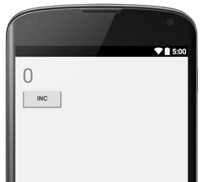
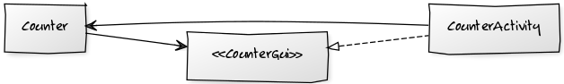

# Presenter First

How do you TDD a GUI application?

The Presenter First style of TDD is usually appropriate when we write GUI applications.  The idea is that you start by postulating that you will have at least two objects: a *Presenter* and a *View*.  The *Presenter* is an object that represents your whole application, or a significant subset of your application.  The *View* represent the GUI screen that your application will use.

I> **The "View" ambiguity**
I>
I> The word "view" in the Android world has a specific meaning, but when we talk of presenters and views, we mean something different.  A view in Android is a subclass of class `View`.  In the context of presenters instead, a "view" is a role that is played sometimes by Android activities, sometimes by actual Android views.  We trust that context will make it clear what we mean in each case.

One key idea is that all application logic goes in the Presenter, while all technical details of how to show windows etc to the user go in the view.  The presenter is notified by the view that something happened.  In response, the presenter calls methods on the view to change what the user sees.

Another key idea is that you start TDD with the presenter.

J.B. Rainsberger popularized the concept in his video [The World's Best Intro To TDD](#jbrains-tdd-video) and in his book [Responsible Design For Android](#jbrains-book)

The presenter-first method works by defining (at least) two objects:

When we describe what a GUI application does, we usually reason in terms of "when the user does THIS, then the application shows THAT".  For instance, consider an application that shows a counter that can be incremented by the user by pressing a button.  Our Example will say:

>    **Example: increment**
>    Given that the current counter value is 0
>    When the user presses the "INC" button
>    Then the view will show 1

{width=50%}

### First version: not yet quite a presenter

A simple test for this example could be

    CounterApp app = new CounterApp(0);
    app.increment();
    assertEquals(1, app.valueToDisplay());

This test is adequate.  You can use it to develop your application.  It's easy to connect this `CounterApplication` logic to a GUI written in Android.  In the following code, we show how to use the `CounterApp` in an activity:

{line-numbers=on}
~~~~~
public class CounterActivity extends Activity {
  private CounterApp app = new CounterApp();

  @Override
  protected void onCreate(Bundle savedInstanceState) {
    super.onCreate(savedInstanceState);
    setContentView(R.layout.activity_counter);

    Button incrementButton = (Button) findViewById(R.id.increment);
    incrementButton.setOnClickListener(new View.OnClickListener() {
      @Override
      public void onClick(View v) {
        app.increment();
        TextView textView = (TextView) findViewById(R.id.counter);
        textView.setText(String.valueOf(app.valueToDisplay()));
      }
    });
  }
}
~~~~~

In lines 9-10 we make sure that when the user clicks the "increment" button, Android will call us back.   In line 13 we increment the counter, and in lines 14-15 we update the text label.

### A proper presenter

The previous example works and is adequate for most purposes; yet it's not completely satisfactory.  We need to write many lines of "glue" to make sure that we are really getting the right data from the CounterApp and using correctly in the activity.  We are calling the CounterApp twice, one for communicating the fact that the user has pressed the button, and another time for asking back the CounterApp for the value to display.

This is adequate for such a small application, but becomes boring when the number of bits of user interface that *could* change increases.  If we had 100 text fields on the GUI, we wouldn't like to ask 100 questions to the app so that we can update them all.

    // Something we would definitely NOT want to do
    public void onClick(View v) {
      app.doSomething();
      // ask the app the value of ALL fields in case one of them
      // is changed...
      findViewById(R.id.display0).setText(app.valueToDisplay0()));
      findViewById(R.id.display1).setText(app.valueToDisplay1()));
      findViewById(R.id.display2).setText(app.valueToDisplay2()));
      findViewById(R.id.display3).setText(app.valueToDisplay3()));
      findViewById(R.id.display4).setText(app.valueToDisplay4()));
      findViewById(R.id.display5).setText(app.valueToDisplay5()));
      // etc etc ...
    }

It would be much better if the app could update directly the fields it wishes to change.  What if it was simply like this:

~~~~~
public class CounterActivity extends Activity {
  private CounterApp app = new CounterApp(this);

  @Override
  protected void onCreate(Bundle savedInstanceState) {
    super.onCreate(savedInstanceState);
    setContentView(R.layout.activity_counter);

    View incrementButton = findViewById(R.id.increment);
    incrementButton.setOnClickListener(new View.OnClickListener() {
      @Override
      public void onClick(View v) {
        // Just notify the app, it will do the rest
        app.increment();
      }
    });
  }
}
~~~~~

The activity is vastly simplified: all we have to do is call `app.increment()` whenever the user clicks the button.

~~~~~
public class CounterApp {
  private int value;
  private CounterActivity counterActivity;

  public CounterApp(CounterActivity counterActivity) {
    this.counterActivity = counterActivity;
  }

  // We're not quite there yet!
  // We shouldn't mess with the internals of the activity!
  public void increment() {
    value++;
    TextView view = (TextView) counterActivity.findViewById(R.id.counter);
    view.setText(String.valueOf(value));
  }
}
~~~~~

The changing of the value displayed on the GUI has become a responsibility of the CounterApp.  We don't really like this; we'd like to be able to tell the activity "show this value!" and let the activity deal with the details of which element of the view to update.

We have created a circular dependency between the activity and the app

<!--
http://yuml.me/diagram/scruffy/class/edit/[Counter]<->[CounterActivity]

    +--------------+                +-------------------+
    |  CounterApp  | <----------\>  |  CounterActivity  |
    +--------------+                +-------------------+

-->

And this is bad.  We would much prefer that the CounterApp be independent of the CounterActivity.  Luckily, there is a standard way to break circular dependencies: introduce an interface!

<!--
http://yuml.me/diagram/scruffy/class/edit/[Counter]->[<<CounterGui>>], [<<CounterGui>>]^-.-[CounterActivity], [Counter]<-[CounterActivity]

    +--------------+                +----------<I>-+
    |  CounterApp  | -----------\>  |  CounterGui  |
    +--------------+                +--------------+
           ^                               ^
           |                               |
           |                      +-------------------+
           |______________________|  CounterActivity  |
                                  +-------------------+

-->

We introduce an interface we call `CounterGui` (We could have chosen the name `CounterView`, but that could create confusion with the way Android uses the word "view")

So let's start again with the presenter.  We write a test of what the CounterApp should do when the increment method is called.  The test should do, in pseudo code:

    Given the CounterApp holds a reference of the CounterGui as a collaborator
    when we call increment on the CounterApp
    then the CounterGui receives a call to display "1"

We want to test CounterApp without ever referring to the CounterActivity, that in our intentions will be the one real implementation of CounterGui.  Therefore, we need a fake implementation of CounterGui.  Our fake implementation will be passed as a collaborator to the CounerApp, and it does not need to implement a real GUI; all we need is that we can check that the proper call(s) to it have been made.  This type of fake implementation of an interface is called a "Mock".

D> Definition: a "mock" is a fake implementation of an interface that can be used to verify that certain calls have been made to it.

There are more than one way to write this mock.  The simplest way needs no particular mocking frameworks.  Just let the test class implement the interface that we want to use.

~~~~~
// Our test class implements CounterGui
public class CounterAppTest implements CounterGui {

  @Test
  public void increment() throws Exception {
    // We create the app, passing the test class itself as a collaborator
    CounterApp app = new CounterApp(this);

    // Whenever we call
    app.increment();

    // We expect display(1) to have been called
    assertEquals(Integer.valueOf(1), displayedNumber);
  }

  // we use this variable to check that CounterGui#display(1) was called
  Integer displayedNumber = null;

  // and this is our fake implementation of CounterGui#display
  @Override
  public void display(int number) {
    this.displayedNumber = number;
  }
}
~~~~~

Note that writing this test forces us to define the one method that the CounterGui needs to have, namely `display`.  We use a trick to verify that the display method has really been called.  If it is not called, the value of `displayedNumber` remains null.  If it is called, the value of `displayedNumber` is the value of the argument to the call.

This is enough to allow us to see the test fail, and then build the right functionality within CounterApp to make it pass.  It's easily done:

~~~~~
public class CounterApp {
  private int value;
  private CounterGui gui;

  public CounterApp(CounterGui gui) {
    this.gui = gui;
  }

  public void increment() {
    value++;
    gui.display(value);
  }
}
~~~~~

Note, however, that if CounterApp made more than one call to CounterGui, we would not be able to detect this.  We only retain the argument of the last call.

Using a mocking framework such as JMock or EasyMock solves this problem.  It also makes it easier to specify precisely what we expect: "just ONE call to CounterGui#display with the argument 1".  The price we pay is that we need to use more sophisticated machinery (see chapter [How JMock Works](#appendix-jmock)).

The following is the same test, implemented with JMock.

~~~~~
public class CounterAppTest {

  // This is the JMock machinery that we need
  @Rule public JUnitRuleMockery context = new JUnitRuleMockery();

  public void testIncrement() throws Exception {
    // We ask JMock to make a mock of the CounterGui interface
    final CounterGui gui = context.mock(CounterGui.class);

    // We create the app, passing the gui as a collaborator
    CounterApp app = new CounterApp(gui);

    // We setup our expectations
    context.checking(new Expectations() {{
      // Exactly one time, gui will be called with display(1)
      oneOf(gui).display(1);
    }});

    // Whenever we call
    app.increment();
  }
}
~~~~~

The amazing thing is that the presenter test, whether written with hand-made mocks or with a mocking framework, allows us to define the `CounterGui` interface, that is to find all the methods that we need from this interface, even before that an implementation exists!  Here is the interface that emerged:

~~~~~
public interface CounterGui {
  void display(int number);
}
~~~~~

Our next task is to define a real implementation of `CounterGui`.  The obvious choice here is to let `CounterActivity` implement it.  We do it here:

~~~~~
public class CounterActivity extends Activity implements CounterGui {
  private CounterApp app = new CounterApp(this);

  @Override
  protected void onCreate(Bundle savedInstanceState) {
    super.onCreate(savedInstanceState);
    setContentView(R.layout.activity_counter);

    View incrementButton = findViewById(R.id.increment);
    incrementButton.setOnClickListener(new View.OnClickListener() {
      @Override
      public void onClick(View v) {
        app.increment();
      }
    });
  }

  @Override
  public void display(int number) {
    TextView textView = (TextView) findViewById(R.id.counter);
    textView.setText(String.valueOf(number));
  }
}
~~~~~

Notice the nice separation of concerns: the presenter deals with the application logic; the view deals with presentation logic.

### Model, View, Presenter

A Presenter usually deals with a view, as we have seen, and a *model*.  What's a model?  A "model" in this context is a model of the problem domain.  In other words, it's a pure logic implementation of the application logic, independent of any infrastructural issues such as GUIs or persistence.

Wait, didn't we say the same thing about the presenter, just a few pages ago?  Well, sort of.  You see, the Presenter that we have built so far really has two responsibilities:

 1. Implement application logic (in this case, it's the simple counter logic of incrementing the value)
 2. Connecting application logic with the view

You see it in the implementation of method `CounterApp#increment`:

    public void increment() {
      value++;
      gui.display(value);
    }

It is doing two things: incrementing the counter and updating the view.  In this particular case, the application logic is so simple that it might make sense to leave it like this.  In general, however, application logic is complex.  For this reason, it's usually a good idea to separate the model from the presenter.  If we wanted to do so, we would create a `Counter` object that does nothing but counting, and pass it to the presenter as a collaborator.

The result would be a clearer separation of concerns:

~~~~~
public class CounterApp {
  private Counter counter;
  private CounterGui gui;

  public CounterApp(Counter counter, CounterGui gui) {
    this.counter = counter;
    this.gui = gui;
  }

  public void increment() {
    counter.increment();
    gui.display(counter.value());
  }
}
~~~~~

The obvious implementation of `Counter` would be

~~~~~
public class Counter {
  int value = 0;

  public void increment() {
    value++;
  }

  public int value() {
    return value;
  }
}
~~~~~

## Mock objects

Quick, what are mock objects good for?  If you answered "for isolating dependencies" then Bzzzzzzt! You got it wrong!

The real reason why mocks are useful is that they help us developing *protocols*, that is a set of messages that an object must understand in order to fulfill a *role* in an object-oriented system.

<!-- Some objects have responsibilities for *knowing* things.  For instance, a Point object might be responsible for knowing its cartesian coordinates, and it might be a reasonable implementation to give this object "getter" methods so that we can know where in the plane is this Point.

Other objects have responsibilities for *doing* things.  For instance, a Point object could be responsible for knowing how to draw itself on a canvas.

It's easy (if maybe boring) to use TDD to develop the first kind of Point.  But how would you use TDD to define the behaviour of the second kind of test? -->

### Tell, don't ask

An object works by sending and receiving *messages*.  When an object receives a message, it can react by sending messages to other objects.  How do we test an object then?  The simple way is to send a message to an object and then use *getters* to access the object internal state.  One problem with this is that the getters will force us to expose at least part of the object's internal representation.  This will make it harder to change the object.

Not only that.  Using getters will push us to separate data and behaviour.  Consider

    if (point.isPolar()) {
      x = point.getRadius() * Math.cos(point.getAngle());
      y = point.getRadius() * Math.sin(point.getAngle());
    } else {
      x = point.getX();
      y = point.getY();
    }
    canvas.drawPoint(x, y);

We ask the point a question: *are you represented with polar coordinates?* Then depending on the question we do one thing or another.  What we have is that the point is a dumb data structure with no behaviour.  The code that uses the point is doing all the reasoning and has all the behaviour; it converts from polar coordinates to cartesian if necessary, then draws the point on a canvas.

Why do we open up the object and see its internals?  We don't have to!  We could ask the point to give us the cartesian coordinates, doing the conversion internally if necessary.  The above code becomes

    x = point.getX();
    y = point.getY();
    canvas.drawPoint(x, y);

But we can go one step further.  What if the code was

    if (!point.isInvisible()) {
      canvas.drawPoint(point.getX(), point.getY());
    }

Why do we have to ask all this questions to the point object?  Couldn't we just ask it to draw itself unless it's invisible?

    point.drawYourselfUnlessInvisibleOn(canvas);

Now the calling code is much simpler! And it's a lot easier to maintain.  Suppose we add a *color* to the point.  The old calling code would have to change to

    if (!point.isInvisible()) {
      canvas.drawPoint(point.getX(), point.getY(), point.getColor());
    }

but the new calling code does not change much

    point.drawYourselfUnlessInvisibleWithAppropriateColorOn(canvas);

We can increase this isolation by making the name of the message simpler:

    point.drawYourselfOn(canvas)

Here we don't want to know *any* detail: nothing about color, shape, visibility, or anything else.  This isolation makes code **much easier to change**, because changes in the protocol between point and canvas will not impact the callers of either.

This preference for telling objects to do things rather than asking objects to return values was called "Tell, don't ask!" in a famous paper by Andy Hunt and Dave Thomas (TBD - reference).

## Mocks

I hope I've convinced you that *Tell, don't ask* is good.  Now you have a problem: how do you test an object that does not have getters?  Ha!

The only way to do test such an object is to *observe its behaviour*.  That is, we send it a message, and observe what other messages it sends to its neighbours.  I send a `drawYourselfOn(canvas)` message to the point, and I want to test that the canvas was used correctly.  How could I test that?  Should I ask the canvas?  That would require adding *getters* to the canvas.

    // Bleah!  Don't do this!
    for (int x=0; x<=canvas.getMaxX(); x++) {
      for (int y=0; y<=canvas.getMaxY(); y++) {
        if (x == point.getX() && y == point.getY())
          assertEquals(point.getColor(), canvas.getColorAt(x, y));
        else
          assertEquals(WHITE, canvas.getColorAt(x, y));
      }
    }

I'd rather express my test (in pseudocode) this way:

{lang=plain}
    I expect that
      canvas will receive drawPoint(x, y)
    whenever I do
      point.drawYourselfOn(canvas)

So instead of an *assertion* we have an **expectation**.  We expect that the canvas will be called in a certain way, *and nothing else*.  The nice thing in this test is that *we don't care what's the behaviour of the canvas*.  For all we care, we can just assume that `canvas` is just an interface.  This means that we can develop an object with TDD before its collaborators even exist!

The above test, expressed in JMock, would look like the following:

    Point point = new Point(10, 20);
    Canvas canvas = context.mock(Canvas.class);
    context.checking(new Expectations() {{
      oneOf(canvas).drawPoint(10, 20);
    }});
    point.drawYourselfOn(canvas);

The point of this test is that we can use it to define how the point should talk to its collaborator.

The syntax looks a bit esoteric at first, but it will all make sense.  The details on how JMock works are [in the appendix](#appendix-jmock).  More about mocks in [GOOS].

