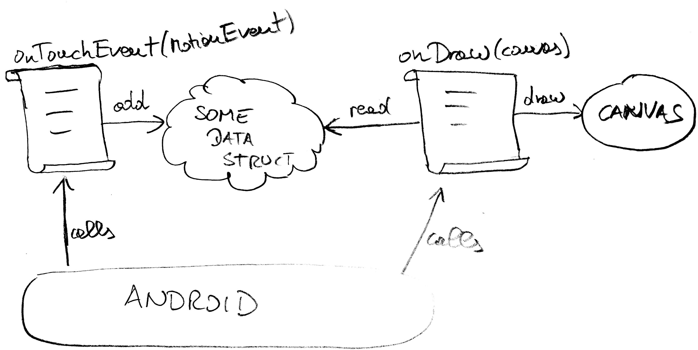

# Drawing on the screen and sensing touch

## Digging deeper into Android

We've seen how to TDD an application based on ordinary form widgets: text fields and buttons.  Now we'd like to go a bit deeper.  How do we TDD an application that reacts to the user's touch and draws directly on the screen?

The goal of this chapter is to further understand how to decouple the tests from the Android APIs, even when we *need* to use those APIs.  You may find the source code for this chapter in [https://github.com/xpmatteo/fairy-fingers](https://github.com/xpmatteo/fairy-fingers).

## Problem Description

This problem was invented by Carlo Pescio for his [Ribbons](http://www.aspectroid.com/) book.  The user draws colored lines by dragging fingers on the screen.  The lines fade quickly to nothing.  We call our app "Fairy Fingers".

## Start with a spike

The goals of the spike are:

 * Understand how to draw on the screen
 * Understand how to track the user's finger

We create an empty project and check that it shows a "hello world" on our device.   Then we modify the `app/res/layout/content_main.xml` file, removing the standard "hello world" view and replacing it with a custom view:

{lang="xml"}
~~~~~
<RelativeLayout xmlns:android="http://schemas.android.com/apk/res/android"
    xmlns:tools="http://schemas.android.com/tools"
    android:layout_width="match_parent"
    android:layout_height="match_parent"
    tools:context=".MainActivity">

    leanpub-start-delete
    <TextView
            android:layout_width="wrap_content"
            android:layout_height="wrap_content"
            android:text="Hello World!"/>
    leanpub-start-delete

    leanpub-start-insert
    <com.tdd4android.fairyfingers.spike.MyView
        android:layout_width="wrap_content"
        android:layout_height="wrap_content" />
    leanpub-end-insert
</RelativeLayout>
~~~~~

The IDE complains that the `com.tdd4android.fairyfingers.spike.MyView` class does not exist, so we go ahead and create it.  We need to override the constructors.  I don't know which ones are really needed, so I override them all.  Then we need to override the `OnDraw` method.  We want to see if we can paint on the screen at all, so we draw a single line.

~~~~~
package com.tdd4android.fairyfingers.spike;

import android.content.Context;
import android.graphics.*;
import android.util.AttributeSet;
import android.view.View;

public class MyView extends View {
  public MyView(Context context) {
    super(context);
  }
  public MyView(Context context, AttributeSet attrs) {
    super(context, attrs);
  }
  public MyView(Context context, AttributeSet attrs, int defStyleAttr) {
    super(context, attrs, defStyleAttr);
  }

  @Override
  protected void onDraw(Canvas canvas) {
    Paint paint = new Paint();
    paint.setColor(Color.BLUE);
    paint.setStrokeWidth(3);
    canvas.drawLine(10, 10, 100, 100, paint);
  }
}
~~~~~
We run it, and it works!

{width=60%}

Now we want to track the user touching the screen.  Android calls the `onTouchEvent` method whenever the user touches or drags her finger on the screen.  It gives us a `MotionEvent` object that contains the screen coordinates of the user's finger.  We must store those coordinates in a list
 and then draw them in the `onDraw` method.  We must also remember to call `invalidate` after every touch event. This notifies the OS that the screen should be updated; Android will answer by calling `onDraw` later.

~~~~~
public class MyView extends View {
  private List<Point> points = new ArrayList<Point>();

  // ...

  @Override
  protected void onDraw(Canvas canvas) {
    Paint paint = new Paint();
    paint.setColor(Color.BLUE);
    paint.setStrokeWidth(3);
    for (int i=1; i<points.size(); i++) {
      Point from = points.get(i-1);
      Point to = points.get(i);
      canvas.drawLine(from.x, from.y, to.x, to.y, paint);
    }
  }

  @Override
  public boolean onTouchEvent(MotionEvent event) {
    points.add(new Point((int) event.getX(), (int) event.getY()));
    invalidate();
    return true;
  }
}
~~~~~

We drag a finger on the screen and we see the following.

{width=60%}

At the moment, we draw a single line.  Touching again the screen makes the line longer.  The next thing we'd like to do is to draw a new line every time we touch the screen.

The key here is how we use the `MotionEvent` data structure.  The relevant fields return the event coordinates with `getX` and `getY`, and the type of action, that is returned by `getActionMasked`.  The actions we are interested in at the moment are `ACTION_DOWN`, `ACTION_MOVE` and `ACTION_UP`, corresponding to touching, dragging and lifting the finger.  We can exploit this information to clear the old line whenever the finger goes down on the screen.

~~~~~
public boolean onTouchEvent(MotionEvent event) {
  int action = event.getActionMasked();
  if (action == MotionEvent.ACTION_DOWN) {
    points.clear();
    points.add(new Point((int) event.getX(), (int) event.getY()));
  } else if (action == MotionEvent.ACTION_MOVE) {
    points.add(new Point((int) event.getX(), (int) event.getY()));
  }
  invalidate();
  return true;
}
~~~~~

So far, so good.  We could explore the `MotionEvent` further in order to understand multitouch, but we can leave that for later.  We learned enough already for writing a first version of Fairy Fingers that only supports single touch.

What have we learned?  There are two points where we interact with the device.

1. When the user touches the screen, we receive data through the `onTouchEvent(MotionEvent e)` call. We should accumulate these data in some kind of data structure.
2. When the screen is being drawn, Android calls `onDraw(Canvas c)`.  We should use our previously created data structure to know what we should draw on the canvas.

{width=100%}

## Acceptance tests

We start with the following acceptance tests:

 - Single touch.  Dragging the finger should produce a colored trail
 - Fade.  The trails should fade to nothing.
 - Many trails.  We draw a trail, then we draw another.
 - Many colours.  Every time we draw a trail, we should get a different colour
 - Multi-touch.  Dragging two fingers should produce two trails.
 - Multi-touch dashes.  We draw a continuous trail with one finger, and a dashed trail with another finger at the same time.  We should see a pattern like

        --   --   --
        ------------

These acceptance tests are meant to be executed manually.  Some can and will be automated.  The ones that deal with multi-touch cannot be automated with present-generation tools (Monkeyrunner).

Note that we started using the word "trail" instead of "line".  We'd like to have a special name for the "things" that we draw with in this app, and the word "line" is both too generic and too specific.  The Android `canvas` object has a `drawLine` method; we'd like to distinguish our own "lines" from what Android calls a "line".  Therefore we will call them "trails".

## Setup the project

We create a new project for Fairy Fingers.  We start much like we did in the spike; we create a custom view that we call `FairyFingersView`.  Then we add a new `core` module that will contain the pure Java code, as described in the [Hello, World](#hello-world) chapter.

Our entry point will be in methods `onDraw()` and `onTouchEvent()` of the `FairyFingersView`.  We will delegate most of the work to a `FairyFingersCore` object.  We imagine that we will have something like the following pseudo-code:

~~~~~~~
class FairyFingersView extends View {
  private FairyFingersCore core = new FairyFingersCore();

  // constructors ...

  @Override
  protected void onDraw(Canvas canvas) {
    for every trail in core {
      draw the trail on the canvas
    }
  }

  @Override
  public boolean onTouchEvent(MotionEvent event) {
    core.onTouchEvent(event.getActionMasked(), event.getX(), event.getY());
    invalidate();
    return true;
  }
}
~~~~~~~

## Start the TDD

The first step for TDD is to write a test list.  We start by writing a todo list from the acceptance tests list:

 - create a two-points trail
 - create a many-points trail
 - create two trails
 - fade a trail
 - randomize colours
 - draw all the trails

Where do we start?  We choose "create a two points trail" because we'd like to discover how we will solve this. Now we can write the first test.

~~~~~
package com.tdd4android.fairyfingers.core;

import org.junit.Test;
import static org.junit.Assert.*;

public class FairyFingersCoreTest {
  // Constants copied from android.view.MotionEvent
  public static final int ACTION_DOWN             = 0;
  public static final int ACTION_UP               = 1;
  public static final int ACTION_MOVE             = 2;

  @Test
  public void twoPointsTrail() throws Exception {
    FairyFingersCore core = new FairyFingersCore();

    core.onTouchEvent(ACTION_DOWN, 10, 20);
    core.onTouchEvent(ACTION_MOVE, 30, 40);
    core.onTouchEvent(ACTION_UP, 50, 60);

    assertEquals(1, core.trailsCount());
  }
}
~~~~~~

While we write this test, we think of a two simpler ones:

~~~~~
@Test
public void noTrails() throws Exception {
  FairyFingersCore core = new FairyFingersCore();
  assertEquals(0, core.trailsCount());
}
~~~~~~

and

~~~~~
@Test
public void unfinishedTrail() throws Exception {
  FairyFingersCore core = new FairyFingersCore();

  core.onTouchEvent(ACTION_DOWN, 10, 20);
  core.onTouchEvent(ACTION_MOVE, 30, 40);

  assertEquals(1, core.trailsCount());
}
~~~~~

The last one is needed because we expect the trail to be visible even while it's not finished yet.

The first implementation of `FairyFingersCore` makes these three tests pass, but is not very useful yet.

~~~~~
package com.tdd4android.fairyfingers.core;

public class FairyFingersCore {
  private int trailsCount;

  public int trailsCount() {
    return trailsCount;
  }

  public void onTouchEvent(int action, float x, float y) {
    if (action == ACTION_DOWN)
      trailsCount++;
  }
}
~~~~~

The problem is in the assertions.  The assertion on the `trailsCount()` by itself is not very useful.  It does not prove that the important data about the trail have been memorized. How can we improve the tests in a way that forces us to flesh out `FairyFingersCore` better?

(Pause for a minute.  What would YOU do?)

* * *

The FairyFingersCore should build a Trail object, and we'd like this Trail to contain exactly the coordinates that were supplied by the tests.  One way to do this is with getters:

~~~~~
assertEquals(10, core.getTrail(0).getPoints(0).getX());
assertEquals(20, core.getTrail(0).getPoints(0).getY());
assertEquals(30, core.getTrail(0).getPoints(1).getX());
assertEquals(40, core.getTrail(0).getPoints(1).getY());
~~~~~

But this test code is extremely boring to write!  Being bored is an important signal.  It's the test pushing back: it doesn't want to be written like this.  One concrete problem is that there are too many "dots" in the assertion.  We dig too much further into the objects.  One other problem is that we are assuming that we will need all those getters; it's not clear yet that these getters will be used in production code.

Trick: use "toString".  The `toString` of the `Trail` will certainly be needed for debugging and logging.  How about:

~~~~~
assertEquals("(10,20)->(30,40)", core.getTrail(0).toString());
~~~~~

In our test, we are only assuming that the `FairyFingersCore` will return an object that somehow contains the expected points in a certain order.  We don't even assert what kind of object it is.  It looks promising!  The tests are rewritten in the following style:

~~~~~~
package it.xpug.fairyfingers.core;
// ...
public class FairyFingersCoreTest {
  private FairyFingersCore core = new FairyFingersCore();

  @Test
  public void noTrails() throws Exception {
    assertEquals(0, core.trailsCount());
  }

  @Test
  public void justFingerDown() throws Exception {
    core.onTouchEvent(Actions.ACTION_DOWN, 10, 20);

    assertEquals(1, core.trailsCount());
    assertEquals("(10.0,20.0)", core.getTrail(0).toString());
  }

  @Test
  public void unfinishedTrail() throws Exception {
    core.onTouchEvent(Actions.ACTION_DOWN, 100, 200);
    core.onTouchEvent(Actions.ACTION_MOVE, 300, 400);

    assertEquals(1, core.trailsCount());
    assertEquals("(100.0,200.0)->(300.0,400.0)", core.getTrail(0).toString());
  }

  @Test
  public void oneFinishedTrail() throws Exception {
    core.onTouchEvent(Actions.ACTION_DOWN,   1.1f,   2.2f);
    core.onTouchEvent(Actions.ACTION_MOVE,  33.3f,  44.4f);
    core.onTouchEvent(Actions.ACTION_UP,   555.5f, 666.6f);

    assertEquals(1, core.trailsCount());
    assertEquals("(1.1,2.2)->(33.3,44.4)->(555.5,666.6)", core.getTrail(0).toString());
  }
}
~~~~~~
A> We moved the FairyFingersCore object in a field, in order to remove the duplication of creating it in every test.  We could use a `@Before` method to initialize it, but doing it this way is shorter.  We rely on the fact that JUnit creates a new `FairyFingersCoreTest` object for every test method it calls.  Therefore, every test has a fresh `FairyFingersCore` object.
A>
A> Also note that we always use different numbers in the tests.  If we wrote `core.onTouchEvent(ACTION_DOWN, 10, 10)` we would be open to the risk of swapping x and y in our production code.
A>
A> We avoid using the same test data in multiple tests.  Using always different data prevents us to leave hardcoded test data in production code!
A>
A> One last observation: Android uses the `float` data type for coordinates. Our code should do the same.

Eventually we get to write the first test that forces the core to contain more than one trail:

    @Test
    public void twoTrails() throws Exception {
      core.onTouchEvent(ACTION_DOWN, 1.0f, 100.0f);
      core.onTouchEvent(ACTION_MOVE, 2.0f, 200.0f);
      core.onTouchEvent(ACTION_UP,   3.0f, 300.0f);

      core.onTouchEvent(ACTION_DOWN, 4.0f, 400.0f);
      core.onTouchEvent(ACTION_MOVE, 5.0f, 500.0f);
      core.onTouchEvent(ACTION_UP,   6.0f, 600.0f);

      assertEquals(2, core.trailsCount());
      assertEquals("(1.0,100.0)->(2.0,200.0)->(3.0,300.0)", core.getTrail(0).toString());
      assertEquals("(4.0,400.0)->(5.0,500.0)->(6.0,600.0)", core.getTrail(1).toString());
    }

A> To make the exposition shorter, we are showing you the end results of many TDD red-green-refactor cycles.

The implementation that we get after passing the last test is the following:

    public class FairyFingersCore {
      private List<Trail> trails = new ArrayList<>();

      public void onTouchEvent(int action, float x, float y) {
        if (ACTION_DOWN == action) {
          // create a new trail when the user puts a finger down
          trails.add(new Trail(x, y));
        } else {
          trails.get(trails.size() - 1).append(x, y);
        }
      }

      public int trailsCount() {
        return trails.size();
      }

      public Trail getTrail(int index) {
        return trails.get(index);
      }
    }

    public class Trail {
      private List<Point> points = new ArrayList<>();

      public Trail(float x, float y) {
        points.add(new Point(x, y));
      }

      public void append(float x, float y) {
        points.add(new Point(x, y));
      }

      @Override
      public String toString() {
        String description = "";
        for (Point p : points) {
          if (!description.isEmpty())
            description += "->";
          description += p.toString();
        }
        return description;
      }
    }

    class Point {
      float x, y;

      public Point(float x, float y) {
        this.x = x;
        this.y = y;
      }

      @Override
      public String toString() {
        return String.format("(%.1f,%.1f)", x, y);
      }
    }

## Moving on to drawing

In the last section we have completed (more or less) the data-gathering activity that we should do in response to motion events from Android.  What is missing?  Of course what is missing is drawing on the screen!  Our implementation of `Trail` does nothing.  We should find a way to let it interact with the Android `Canvas` object.  How do we do this?  Let's start with a test!

    import static org.mockito.Mockito.verify;

    public class TrailTest {
      @Test
      public void drawOneSegment() throws Exception {
       Trail trail = new Trail(10f, 20f);
       trail.append(30f, 40f);
       trail.drawOn(canvas);

       // does not compile: canvas is not defined
       verify(canvas).drawLine(10f, 20f, 30f, 40f);
     }
    }

The above is the gist of what we'd like to test.  If I have a trail from point A to point B, it will be able to draw a line from A to B on a canvas.  Wait, but what kind of canvas is that?  It certainly can't be an `android.graphics.Canvas`, because that would introduce a dependency on the Android framework!  What would you do here?

* * *

What we should do is to apply Dependency Inversion: we define our own canvas interface.  We may call it `CoreCanvas`, to make it clear that it belongs in the core of the application.  The complete test then is:

    import static org.mockito.Mockito.mock;
    import static org.mockito.Mockito.verify;

    public class TrailTest {
      @Test
      public void drawOneSegment() throws Exception {
        CoreCanvas canvas = mock(CoreCanvas.class);

        Trail trail = new Trail(10f, 20f);
        trail.append(30f, 40f);
        trail.drawOn(canvas);

        verify(canvas).drawLine(10f, 20f, 30f, 40f);
        verifyNoMoreInteractions(canvas);
     }
    }

This does not compile, because we don't have a `drawOn(CoreCanvas c)` method in our `Trail` class, and moreover we don't have a `drawLine(...)` method in our `CoreCanvas` interface.  We fix both compilation errors, and we find we have *discovered* one method that `CoreCanvas` must contain.

A> The `drawLine` method of the Android `Canvas` class has one more parameter: `drawLine(float startX, float startY, float stopX, float stopY, Paint paint)`.  It has a Paint parameter.  We still haven't reasoned about the color and texture of the lines we will draw on the screen, so we must assume that any implementation of `CoreCanvas` will use a default `Paint`.  This is good: our `CoreCanvas` is a gread deal simpler to use than the Android `Canvas`.  It only offers the features that we need.

The simplest code that makes the above test pass is

    public class Trail {
      // ...
      leanpub-start-insert
      public void drawOn(CoreCanvas canvas) {
        canvas.drawLine(points.get(0).x, points.get(0).y, points.get(1).x, points.get(1).y);
      }
      leanpub-end-insert
    }

After a few cycles of red-green-refactor we get to the following tests:

    public class TrailTest {
      CoreCanvas canvas = mock(CoreCanvas.class);

      @Test
      public void drawNothing() throws Exception {
        Trail trail = new Trail(1f, 2f);

        trail.drawOn(canvas);
      }

      @Test
      public void drawOneSegment() throws Exception {
        Trail trail = new Trail(10f, 20f);
        trail.append(30f, 40f);

        trail.drawOn(canvas);

        verify(canvas).drawLine(10f, 20f, 30f, 40f);
      }

      @Test
      public void drawTwoSegments() throws Exception {
        Trail trail = new Trail(100f, 200f);
        trail.append(300f, 400f);
        trail.append(500f, 600f);

        trail.drawOn(canvas);

        verify(canvas).drawLine(100f, 200f, 300f, 400f);
        verify(canvas).drawLine(300f, 400f, 500f, 600f);
      }

      @After
      public void noMoreInteractions() {
        verifyNoMoreInteractions(canvas);
      }
    }

T> We added an `@After`-annotated method to check for every test that all interactions with the mock were expected in the test.  This compensates for the fact that Mockito does not offer "strict" mocks, that is, mocks that complain by default whenever they are asked to do something that was not expected.

The production code that makes the above tests pass is

    public class Trail {
      // ...
      public void drawOn(CoreCanvas canvas) {
        leanpub-start-insert
        Point start = points.get(0);
        for (int i=1; i<points.size(); i++) {
          Point stop = points.get(i);
          canvas.drawLine(start.x, start.y, stop.x, stop.y);
          start = stop;
        }
        leanpub-end-insert
      }
    }

A> We know that the `points` field always contains at least one point, because it is added by the constructor.

## Trying it out!

We are now ready to see if the work we've done so far works.  We change the view to become:

    public class FairyFingersView extends View {
      leanpub-start-insert
      FairyFingersCore core = new FairyFingersCore();
      leanpub-end-insert

      // constructors...

      @Override
      protected void onDraw(Canvas canvas) {
        leanpub-start-insert
        for (int i=0; i<core.trailsCount(); i++) {
          core.getTrail(i).drawOn(new AndroidCoreCanvas(canvas));
        }
        leanpub-end-insert
      }

      @Override
      public boolean onTouchEvent(MotionEvent event) {
        leanpub-start-insert
        core.onTouchEvent(event.getActionMasked(), event.getX(), event.getY());
        invalidate();
        return true;
        leanpub-end-insert
      }
    }

The only bit that we haven't described is the Android implementation of `CoreCanvas`, which we called, predictably, `AndroidCoreCanvas`.  The implementation is very simple:

    package com.tdd4android.fairyfingers;

    import android.graphics.Canvas;
    import android.graphics.Color;
    import android.graphics.Paint;

    import com.tdd4android.fairyfingers.core.CoreCanvas;

    public class AndroidCoreCanvas implements CoreCanvas {
      private Canvas canvas;
      private Paint paint = new Paint();

      public AndroidCoreCanvas(Canvas canvas) {
        this.canvas = canvas;
        paint.setColor(Color.BLUE);
        paint.setStrokeWidth(3);
      }

      @Override
      public void drawLine(float startX, float startY, float stopX, float stopY) {
        canvas.drawLine(startX, startY, stopX, stopY, paint);
      }
    }

We run the application, and it works!

{id="first-demo-after-tdd",width=50%,float=left}

What have we accomplished?  We have rewritten the spike using TDD. It does not do much more than what the spike did, although, as it can be seen in the [screenshot](#first-demo-after-tdd), it keeps track of different, separate trails.  Anyway, important thing is that this app was developed with TDD, it is simple and well-tested, and we are in a very good position to evolve it!

What is missing?  Looking back at our list of ATs, we see that we are passing two of them:

- (DONE) Single touch.  Dragging the finger should produce a colored trail
- Fade.  The trails should fade to nothing.
- (DONE) Many trails.  We draw a trail, then we draw another.
- Many colours.  Every time we draw a trail, we should get a different colour
- Multi-touch.  Dragging two fingers should produce two trails.
- Multi-touch dashes.  We draw a continuous trail with one finger, and a dashed trail with another finger at the same time.

In the following chapter, we'll focus on fading and multi-touch.
